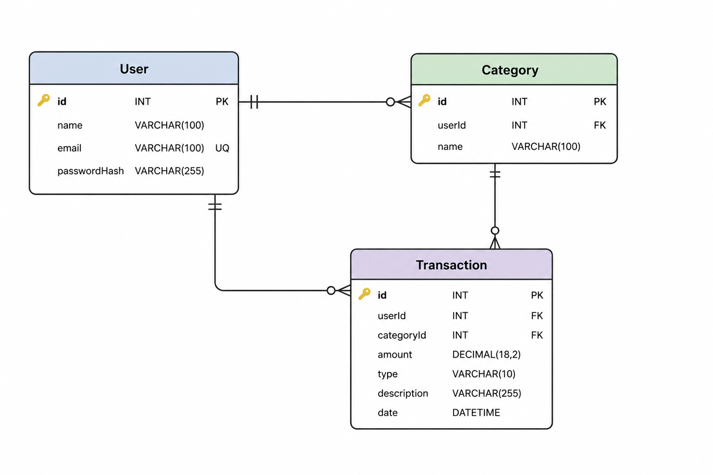

# Финансовый трекер расходов

## Этап 1. Проектирование доменной области

## 1. Описание предметной области

Проект представляет собой финансовый трекер для учета личных доходов и расходов пользователя.

Основная задача приложения - позволить пользователю фиксировать свои финансовые операции, распределять их по категориям и получать отчетность за выбранный период.

## 2. Бизнес-контекст

Пользователь хочет понимать, сколько денег он получает и тратит, а также на какие категории уходят основные расходы.

Например, пользователь может добавить расход на еду, транспорт или одежду, а затем посмотреть отчет за месяц и понять, сколько он потратил по каждой категории.

## 3. Основные сценарии использования

### 3.1 Регистрация пользователя

Пользователь создает учетную запись в системе.

**Основной сценарий:**

1. Пользователь вводит имя, email и пароль.
2. Система проверяет корректность данных.
3. Система создает пользователя.
4. Пользователь получает возможность работать со своими категориями и операциями.

---

### 3.2 Авторизация пользователя

Пользователь входит в систему, чтобы получить доступ к своим категориям, операциям и отчетам.

**Основной сценарий:**

1. Пользователь вводит email и пароль.
2. Система проверяет введенные данные.
3. Если данные верны, система авторизует пользователя.
4. Пользователь получает доступ к своим финансовым данным.

---

### 3.3 Создание категории

Пользователь создает категорию для доходов или расходов.

**Основной сценарий:**

1. Пользователь вводит название категории.
2. Система сохраняет категорию.

---

### 3.4 Редактирование и удаление категории

Пользователь может изменить название категории или удалить категорию, если она больше не нужна.

**Основной сценарий редактирования:**

1. Пользователь выбирает категорию.
2. Пользователь изменяет название категории.
3. Система проверяет корректность данных.

**Основной сценарий удаления:**

1. Пользователь выбирает категорию.
2. Пользователь удаляет категорию.

---

### 3.5 Добавление финансовой операции

Пользователь добавляет доход или расход.

**Пример:**

Пользователь потратил 500 рублей на еду.

**Основной сценарий:**

1. Пользователь выбирает категорию.
2. Пользователь указывает сумму.
3. Пользователь указывает тип операции: доход или расход.
4. Пользователь добавляет описание и дату.
5. Система сохраняет операцию.

---

### 3.6 Редактирование финансовой операции

Пользователь может изменить ранее добавленную операцию, если ошибся в сумме, категории, описании или дате.

**Основной сценарий:**

1. Пользователь выбирает нужную операцию из списка.
2. Пользователь изменяет данные операции.
3. Система проверяет корректность данных.
4. Система сохраняет обновленную операцию.

---

### 3.7 Удаление финансовой операции

Пользователь может удалить операцию, если она была добавлена ошибочно.

**Основной сценарий:**

1. Пользователь выбирает нужную операцию из списка.
2. Пользователь удаляет операцию.
3. Система удаляет операцию из списка операций пользователя.

---

### 3.8 Просмотр списка операций

Пользователь может посмотреть историю своих доходов и расходов.

**Основной сценарий:**

1. Пользователь открывает список операций.
2. Система показывает все операции пользователя.
3. При необходимости пользователь фильтрует операции по дате, типу или категории.

---

### 3.9 Получение отчета

Пользователь может получить отчет за выбранный период.

**Основной сценарий:**

1. Пользователь выбирает дату начала и дату конца периода.
2. Система находит операции пользователя за этот период.
3. Система считает общую сумму доходов.
4. Система считает общую сумму расходов.
5. Система группирует расходы и доходы по категориям.
6. Система возвращает отчет пользователю.

---

## 4. Основные сущности

В минимальной версии проекта используются следующие сущности:

| Сущность    | Назначение                      |
| ----------- | ------------------------------- |
| User        | Пользователь системы            |
| Category    | Категория финансовой операции   |
| Transaction | Финансовая операция             |
| Report      | Отчет по операциям пользователя |

---

## 5. Описание доменных моделей

## 5.1 User

Сущность пользователя системы.

| Поле         | Тип    | Описание                              |
| ------------ | ------ | ------------------------------------- |
| id           | int    | Уникальный идентификатор пользователя |
| name         | string | Имя пользователя                      |
| email        | string | Email пользователя                    |
| passwordHash | string | Хеш пароля пользователя               |

---

## 5.2 Category

Категория используется для группировки финансовых операций.

| Поле   | Тип    | Описание                           |
| ------ | ------ | ---------------------------------- |
| id     | int    | Уникальный идентификатор категории |
| userId | int    | ID пользователя-владельца          |
| name   | string | Название категории                 |

---

## 5.3 Transaction

Финансовая операция пользователя.

| Поле        | Тип             | Описание                          |
| ----------- | --------------- | --------------------------------- |
| id          | int             | Уникальный идентификатор операции |
| userId      | int             | ID пользователя-владельца         |
| categoryId  | int             | ID категории                      |
| amount      | decimal         | Сумма операции                    |
| type        | TransactionType | Тип операции: доход или расход    |
| description | string          | Описание операции                 |
| date        | DateTime        | Дата операции                     |

---

## 5.4 Report

Отчет не хранится как отдельная таблица в базе данных. Он формируется на основе операций пользователя.

| Поле            | Тип      | Описание                           |
| --------------- | -------- | ---------------------------------- |
| startDate       | DateTime | Начало периода                     |
| endDate         | DateTime | Конец периода                      |
| totalIncome     | decimal  | Общая сумма доходов                |
| totalExpense    | decimal  | Общая сумма расходов               |
| balance         | decimal  | Разница между доходами и расходами |
| itemsByCategory | list     | Группировка операций по категориям |

---

## 6. Связи между сущностями

| Связь                      | Описание                                                |
| -------------------------- | ------------------------------------------------------- |
| User 1 → N Category        | Один пользователь может создать много категорий         |
| User 1 → N Transaction     | Один пользователь может создать много операций          |
| Category 1 → N Transaction | Одна категория может использоваться во многих операциях |

## 7. Ограничения

1. Пользователь может работать только со своими данными.
2. Email пользователя должен быть уникальным.
3. Название категории не должно быть пустым.
4. Сумма операции должна быть больше нуля.
5. Тип операции может быть только INCOME или EXPENSE.
6. Операция должна быть привязана к существующей категории.
7. Категория операции должна принадлежать текущему пользователю.
8. Дата начала отчета не может быть позже даты окончания отчета.
9. Отчет строится только по операциям текущего пользователя.

---

## 8. Бизнес-правила

1. Каждый пользователь имеет собственный набор категорий и операций.

2. Пользователь не может видеть, изменять или удалять данные другого пользователя.

3. Категория создается для конкретного пользователя.

4. Категория используется для группировки операций пользователя.

5. Операция может быть только двух типов: доход или расход.

6. При создании операции необходимо указать категорию, сумму, тип операции и дату.

7. Сумма операции всегда должна быть положительной.

8. Если операция имеет тип EXPENSE, она учитывается в общей сумме расходов.

9. Если операция имеет тип INCOME, она учитывается в общей сумме доходов.

10. Отчет формируется за выбранный период и включает только операции текущего пользователя.

11. Итоговый баланс в отчете считается по формуле:

```text
balance = totalIncome - totalExpense
```

12. Расходы и доходы в отчете группируются по категориям.

---

## 9. ER-диаграмма



## Этап 2. Проектирование API и контрактов

## 1. Общая схема взаимодействия

В рамках проекта планируется сервисная backend-архитектура с единым Gateway.

Клиент взаимодействует только с Gateway через REST API. Gateway принимает входящие запросы, проверяет общий формат обращения, передает авторизационные запросы в Auth Service, а запросы по финансовым данным и отчетам - в Transaction Service и Report Service.

Внешний клиент не обращается к внутренним сервисам напрямую. Все взаимодействие пользователя с Auth Service, Transaction Service и Report Service проходит через Gateway.

Gateway и внутренние сервисы взаимодействуют между собой по HTTP. Брокеры сообщений, очереди и асинхронная коммуникация между сервисами в целевой архитектуре не используются.

```text
      Client
        |
        v
     Gateway
        |
        |--- Auth Service
        |--- Transaction Service
        |--- Report Service
```

## 2. Сервисы системы

## 2.1 Gateway

Gateway является единой входной точкой для клиента.

Основные задачи:

- принимать все внешние HTTP-запросы
- направлять запросы авторизации в Auth Service
- направлять запросы по категориям и операциям в Transaction Service
- направлять запросы отчетности в Report Service
- не раскрывать внутренние сервисы напрямую внешнему клиенту
- взаимодействовать с внутренними сервисами по HTTP без брокеров сообщений

## 2.2 Auth Service

Auth Service отвечает за работу с пользователями и авторизацию.

Основные задачи:

- регистрация пользователя
- авторизация пользователя
- получение данных текущего пользователя

## 2.3 Transaction Service

Transaction Service отвечает за категории и финансовые операции пользователя.

Основные задачи:

- создание категории
- получение списка категорий
- получение одной категории
- обновление категории
- удаление категории
- создание финансовой операции
- получение списка операций
- получение одной операции
- обновление операции
- удаление операции

## 2.4 Report Service

Report Service отвечает за построение аналитики.

Основные задачи:

- получить операции пользователя за период
- посчитать общую сумму доходов
- посчитать общую сумму расходов
- сгруппировать операции по категориям

## 3. Общие правила API

Все данные передаются в формате JSON.

Все ручки, кроме регистрации и авторизации, требуют авторизации пользователя.

Для защищенных запросов используется заголовок:

```http
Authorization: Bearer jwt-token
```

Тип операции может принимать только два значения:

```text
INCOME
EXPENSE
```

## 4. Auth Service API

## 4.1 Регистрация пользователя

```http
POST /api/users/register
```

### Request body

```json
{
  "name": "User",
  "email": "user@example.com",
  "password": "123456"
}
```

### Response 201 Created

```json
{
  "id": 1,
  "name": "User",
  "email": "user@example.com"
}
```

### Возможные ошибки

| Код | Причина                                   |
| --- | ----------------------------------------- |
| 400 | Некорректные данные                       |
| 409 | Пользователь с таким email уже существует |

## 4.2 Авторизация пользователя

```http
POST /api/users/login
```

### Request body

```json
{
  "email": "user@example.com",
  "password": "123456"
}
```

### Response 200 OK

```json
{
  "token": "jwt-token",
  "user": {
    "id": 1,
    "name": "User",
    "email": "user@example.com"
  }
}
```

### Возможные ошибки

| Код | Причина                   |
| --- | ------------------------- |
| 400 | Некорректные данные       |
| 401 | Неверный email или пароль |

## 4.3 Получение текущего пользователя

```http
GET /api/users/me
```

### Headers

```http
Authorization: Bearer jwt-token
```

### Response 200 OK

```json
{
  "id": 1,
  "name": "User",
  "email": "user@example.com"
}
```

### Возможные ошибки

| Код | Причина                     |
| --- | --------------------------- |
| 401 | Пользователь не авторизован |

## 5. Transaction Service API

## 5.1 Создание категории

```http
POST /api/categories
```

### Headers

```http
Authorization: Bearer jwt-token
```

### Request body

```json
{
  "name": "Еда"
}
```

### Response 201 Created

```json
{
  "id": 1,
  "userId": 1,
  "name": "Еда"
}
```

### Возможные ошибки

| Код | Причина                                    |
| --- | ------------------------------------------ |
| 400 | Некорректные данные                        |
| 401 | Пользователь не авторизован                |
| 409 | Категория с таким названием уже существует |

## 5.2 Получение категорий пользователя

```http
GET /api/categories
```

### Headers

```http
Authorization: Bearer jwt-token
```

### Response 200 OK

```json
[
  {
    "id": 1,
    "userId": 1,
    "name": "Еда"
  },
  {
    "id": 2,
    "userId": 1,
    "name": "Транспорт"
  }
]
```

### Возможные ошибки

| Код | Причина                     |
| --- | --------------------------- |
| 401 | Пользователь не авторизован |

## 5.3 Получение одной категории

```http
GET /api/categories/{id}
```

### Headers

```http
Authorization: Bearer jwt-token
```

### Response 200 OK

```json
{
  "id": 1,
  "userId": 1,
  "name": "Еда"
}
```

### Возможные ошибки

| Код | Причина                                    |
| --- | ------------------------------------------ |
| 401 | Пользователь не авторизован                |
| 403 | Категория принадлежит другому пользователю |
| 404 | Категория не найдена                       |

## 5.4 Обновление категории

```http
PUT /api/categories/{id}
```

### Headers

```http
Authorization: Bearer jwt-token
```

### Request body

```json
{
  "name": "Продукты"
}
```

### Response 200 OK

```json
{
  "id": 1,
  "userId": 1,
  "name": "Продукты"
}
```

### Возможные ошибки

| Код | Причина                                    |
| --- | ------------------------------------------ |
| 400 | Некорректные данные                        |
| 401 | Пользователь не авторизован                |
| 403 | Категория принадлежит другому пользователю |
| 404 | Категория не найдена                       |
| 409 | Категория с таким названием уже существует |

## 5.5 Удаление категории

```http
DELETE /api/categories/{id}
```

### Headers

```http
Authorization: Bearer jwt-token
```

### Response 200 OK

```json
{
  "message": "Category deleted successfully"
}
```

### Возможные ошибки

| Код | Причина                                                  |
| --- | -------------------------------------------------------- |
| 401 | Пользователь не авторизован                              |
| 403 | Категория принадлежит другому пользователю               |
| 404 | Категория не найдена                                     |
| 409 | Категорию нельзя удалить, потому что у нее есть операции |

## 5.6 Создание финансовой операции

```http
POST /api/transactions
```

### Headers

```http
Authorization: Bearer jwt-token
```

### Request body

```json
{
  "categoryId": 1,
  "amount": 500,
  "type": "EXPENSE",
  "description": "Обед в кафе",
  "date": "2026-05-26"
}
```

### Response 201 Created

```json
{
  "id": 1,
  "userId": 1,
  "categoryId": 1,
  "categoryName": "Еда",
  "amount": 500,
  "type": "EXPENSE",
  "description": "Обед в кафе",
  "date": "2026-05-26"
}
```

### Возможные ошибки

| Код | Причина                                    |
| --- | ------------------------------------------ |
| 400 | Некорректные данные                        |
| 401 | Пользователь не авторизован                |
| 403 | Категория принадлежит другому пользователю |
| 404 | Категория не найдена                       |

## 5.7 Получение операций пользователя

```http
GET /api/transactions
```

### Headers

```http
Authorization: Bearer jwt-token
```

### Query parameters

Параметры необязательные.

```http
GET /api/transactions?startDate=2026-05-01&endDate=2026-05-31&type=EXPENSE&categoryId=1
```

| Параметр   | Тип    | Описание                         |
| ---------- | ------ | -------------------------------- |
| startDate  | string | Начало периода                   |
| endDate    | string | Конец периода                    |
| type       | string | Тип операции: INCOME или EXPENSE |
| categoryId | int    | ID категории                     |

### Response 200 OK

```json
[
  {
    "id": 1,
    "userId": 1,
    "categoryId": 1,
    "categoryName": "Еда",
    "amount": 500,
    "type": "EXPENSE",
    "description": "Обед в кафе",
    "date": "2026-05-26"
  },
  {
    "id": 2,
    "userId": 1,
    "categoryId": 2,
    "categoryName": "Зарплата",
    "amount": 70000,
    "type": "INCOME",
    "description": "Зарплата за май",
    "date": "2026-05-20"
  }
]
```

### Возможные ошибки

| Код | Причина                           |
| --- | --------------------------------- |
| 400 | Некорректные параметры фильтрации |
| 401 | Пользователь не авторизован       |

## 5.8 Получение одной операции

```http
GET /api/transactions/{id}
```

### Headers

```http
Authorization: Bearer jwt-token
```

### Response 200 OK

```json
{
  "id": 1,
  "userId": 1,
  "categoryId": 1,
  "categoryName": "Еда",
  "amount": 500,
  "type": "EXPENSE",
  "description": "Обед в кафе",
  "date": "2026-05-26"
}
```

### Возможные ошибки

| Код | Причина                                   |
| --- | ----------------------------------------- |
| 401 | Пользователь не авторизован               |
| 403 | Операция принадлежит другому пользователю |
| 404 | Операция не найдена                       |

## 5.9 Обновление операции

```http
PUT /api/transactions/{id}
```

### Headers

```http
Authorization: Bearer jwt-token
```

### Request body

```json
{
  "categoryId": 1,
  "amount": 650,
  "type": "EXPENSE",
  "description": "Обед в кафе и кофе",
  "date": "2026-05-26"
}
```

### Response 200 OK

```json
{
  "id": 1,
  "userId": 1,
  "categoryId": 1,
  "categoryName": "Еда",
  "amount": 650,
  "type": "EXPENSE",
  "description": "Обед в кафе и кофе",
  "date": "2026-05-26"
}
```

### Возможные ошибки

| Код | Причина                                                 |
| --- | ------------------------------------------------------- |
| 400 | Некорректные данные                                     |
| 401 | Пользователь не авторизован                             |
| 403 | Операция или категория принадлежит другому пользователю |
| 404 | Операция или категория не найдена                       |

## 5.10 Удаление операции

```http
DELETE /api/transactions/{id}
```

### Headers

```http
Authorization: Bearer jwt-token
```

### Response 200 OK

```json
{
  "message": "Transaction deleted successfully"
}
```

### Возможные ошибки

| Код | Причина                                   |
| --- | ----------------------------------------- |
| 401 | Пользователь не авторизован               |
| 403 | Операция принадлежит другому пользователю |
| 404 | Операция не найдена                       |

## 6. Report Service API

## 6.1 Получение отчета

```http
GET /api/reports/summary
```

### Headers

```http
Authorization: Bearer jwt-token
```

### Query parameters

```http
GET /api/reports/summary?startDate=2026-05-01&endDate=2026-05-31
```

| Параметр  | Тип    | Обязательный | Описание       |
| --------- | ------ | ------------ | -------------- |
| startDate | string | Да           | Начало периода |
| endDate   | string | Да           | Конец периода  |

### Response 200 OK

```json
{
  "startDate": "2026-05-01",
  "endDate": "2026-05-31",
  "totalIncome": 70000,
  "totalExpense": 12500,
  "balance": 57500,
  "itemsByCategory": [
    {
      "categoryId": 1,
      "categoryName": "Еда",
      "type": "EXPENSE",
      "amount": 7000
    },
    {
      "categoryId": 2,
      "categoryName": "Транспорт",
      "type": "EXPENSE",
      "amount": 2500
    },
    {
      "categoryId": 3,
      "categoryName": "Зарплата",
      "type": "INCOME",
      "amount": 70000
    }
  ]
}
```

### Возможные ошибки

| Код | Причина                     |
| --- | --------------------------- |
| 400 | Некорректный период дат     |
| 401 | Пользователь не авторизован |

## 7. DTO-схемы

## 7.1 RegisterUserRequest

```json
{
  "name": "string",
  "email": "string",
  "password": "string"
}
```

## 7.2 UserResponse

```json
{
  "id": "number",
  "name": "string",
  "email": "string"
}
```

## 7.3 LoginRequest

```json
{
  "email": "string",
  "password": "string"
}
```

## 7.4 LoginResponse

```json
{
  "token": "string",
  "user": {
    "id": "number",
    "name": "string",
    "email": "string"
  }
}
```

## 7.5 CreateCategoryRequest

```json
{
  "name": "string"
}
```

## 7.6 UpdateCategoryRequest

```json
{
  "name": "string"
}
```

## 7.7 CategoryResponse

```json
{
  "id": "number",
  "userId": "number",
  "name": "string"
}
```

## 7.8 CreateTransactionRequest

```json
{
  "categoryId": "number",
  "amount": "number",
  "type": "INCOME | EXPENSE",
  "description": "string",
  "date": "YYYY-MM-DD"
}
```

## 7.9 UpdateTransactionRequest

```json
{
  "categoryId": "number",
  "amount": "number",
  "type": "INCOME | EXPENSE",
  "description": "string",
  "date": "YYYY-MM-DD"
}
```

## 7.10 TransactionResponse

```json
{
  "id": "number",
  "userId": "number",
  "categoryId": "number",
  "categoryName": "string",
  "amount": "number",
  "type": "INCOME | EXPENSE",
  "description": "string",
  "date": "YYYY-MM-DD"
}
```

## 7.11 ReportResponse

```json
{
  "startDate": "YYYY-MM-DD",
  "endDate": "YYYY-MM-DD",
  "totalIncome": "number",
  "totalExpense": "number",
  "balance": "number",
  "itemsByCategory": [
    {
      "categoryId": "number",
      "categoryName": "string",
      "type": "INCOME | EXPENSE",
      "amount": "number"
    }
  ]
}
```

## 8. Единый формат ошибок

Для всех сервисов используется единый формат ошибки.

```json
{
  "statusCode": 400,
  "error": "Bad Request",
  "message": "Amount must be greater than zero"
}
```

Основные коды ошибок:

| Код | Название              | Когда используется                                   |
| --- | --------------------- | ---------------------------------------------------- |
| 400 | Bad Request           | Некорректные данные в запросе                        |
| 401 | Unauthorized          | Пользователь не авторизован                          |
| 403 | Forbidden             | Пользователь пытается получить доступ к чужим данным |
| 404 | Not Found             | Объект не найден                                     |
| 409 | Conflict              | Конфликт бизнес-правил                               |
| 500 | Internal Server Error | Непредвиденная ошибка сервера                        |

---

## 9. Запуск и Swagger

Из корневой папки проекта:

```bash
docker compose up --build
```

После запуска доступны:

| Сервис              | URL                           |
| ------------------- | ----------------------------- |
| API Gateway         | http://localhost:5004         |
| Auth Swagger        | http://localhost:5001/swagger |
| Transaction Swagger | http://localhost:5002/swagger |
| Report Swagger      | http://localhost:5003/swagger |

Для проверки защищенных ручек нужно получить JWT через `POST /api/users/login` в Auth Swagger, затем нажать `Authorize` в Swagger нужного сервиса и вставить токен в формате:

```text
Bearer jwt-token
```
